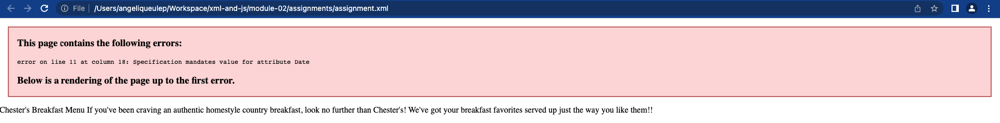
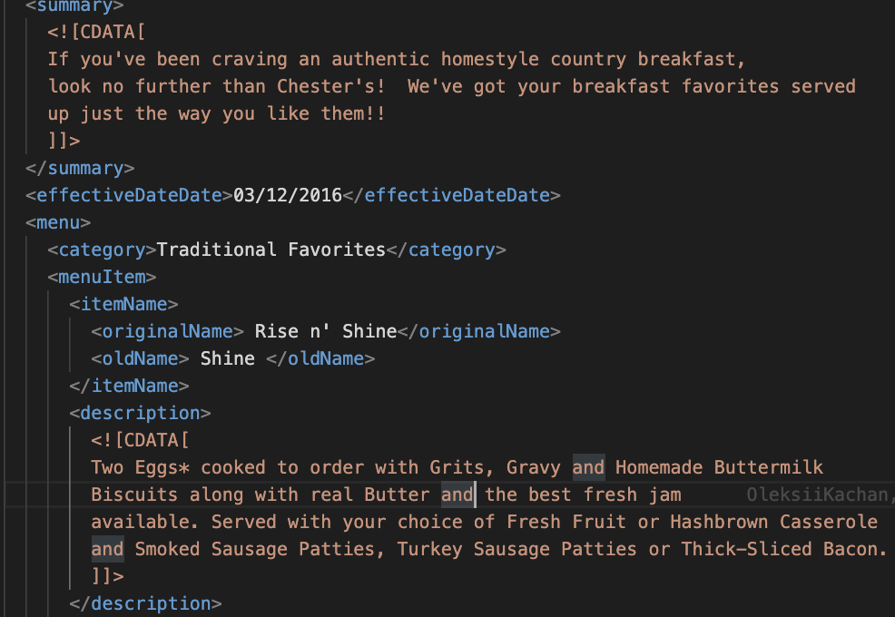
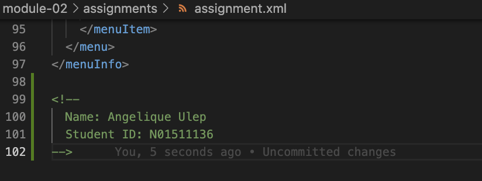
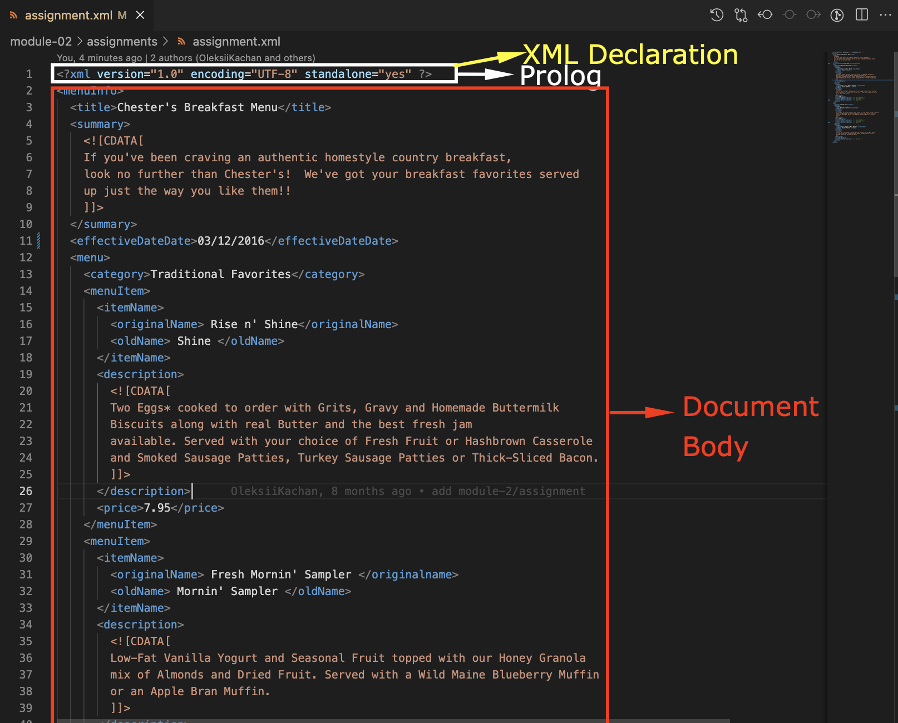
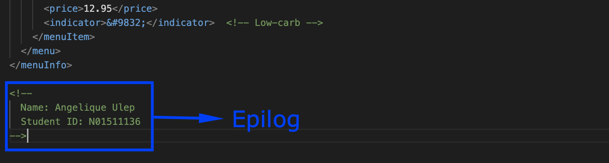
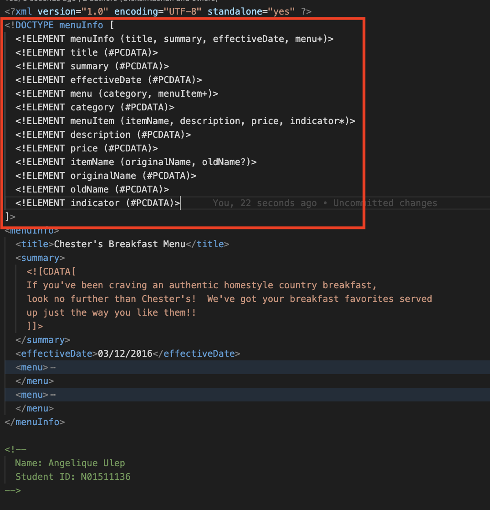
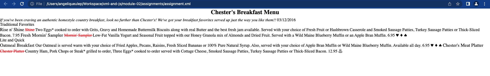
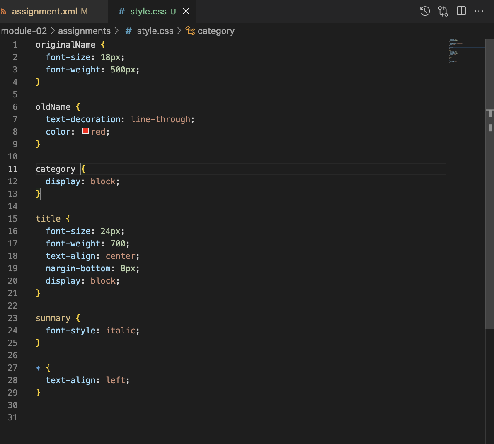

1. The error showed that a value is needed for attrubute Date on line 11. It interprets the Date as an attribute because it is after an element. When adding an attribute, there must be a corresponding value to it.
In this case, the Date text is not an attribute but it is part of the element name. When naming elements, there must be no spaces in between. The error was fixed when the spaces were removed.

2. CDATA block in the summary and description is used in order to treat a block of data as text. There may be special characters in this block of text which may cause an issue when being parsed by XML. CDATA is used in order to eliminate the need to update these values, it may be useful especially for longer blocks of text.

3. 
4. 

5. 
6. 
7. 
