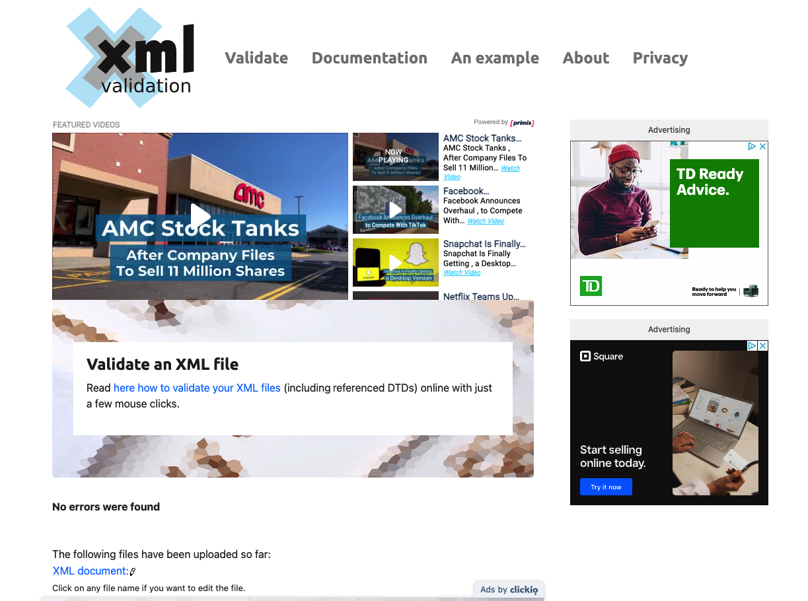
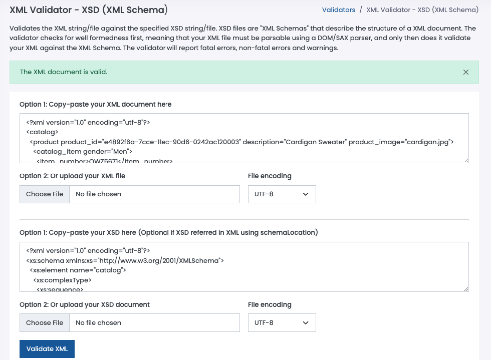

# Validations
2. 
3. 

# Explanation
2. In creating the DTD for `assignment.xml`, I've listed the structure of the xml file first. Also listed the attribute for each element. In each element, the content type is always ***PCDATA*** since it can store character data. For the attributes, ***<!ATTLIST element_name attribute_name attr_type attr_default>*** declaration is used. Since all of them store string data, the ***CDATA*** attr_type is used. Also added the ***#REQUIRED*** default value since all attributes have values in it.
3. In creating the XSD file, I've broken down each element and identified which are elements, attributes and simple elements with attributes to easily create the schema. To make things easier, I separated each complex element in their own types to be able to debug faster in case the xml is deemed not valid. It is also readable for me compared to nested elements. Most attributes and elements are of type string, I've used `xs:double` data type for price instead of `xs:positiveInteger` since there are decimal values in it and precision is important.
Also declared color_swatch as simple content with extension base of string since it only contains a string and no other elements in it, it just has an attribute which is why this special declaration is needed.