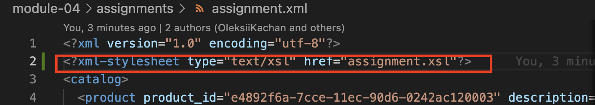
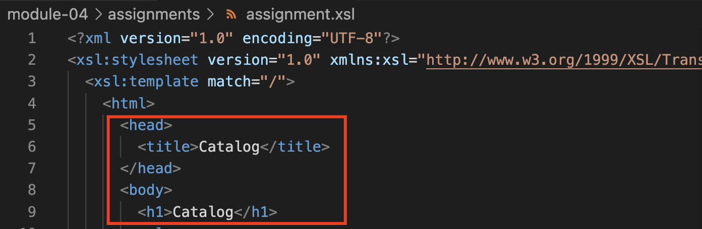
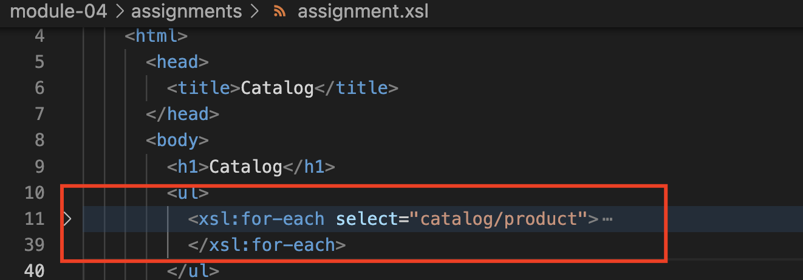
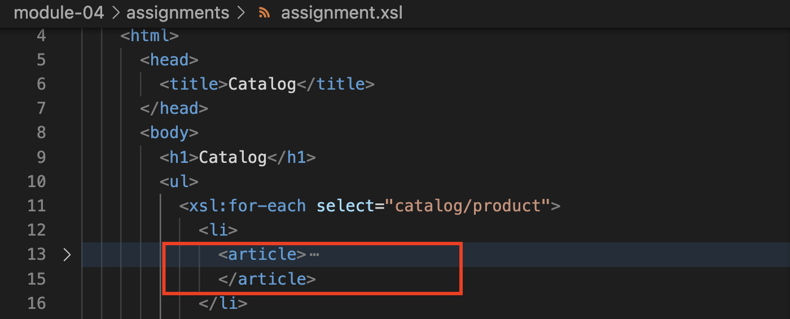
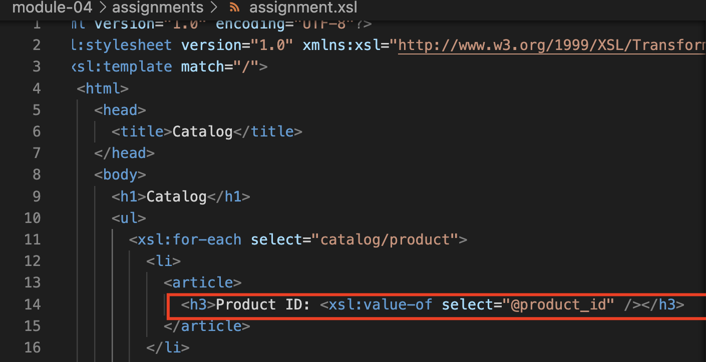
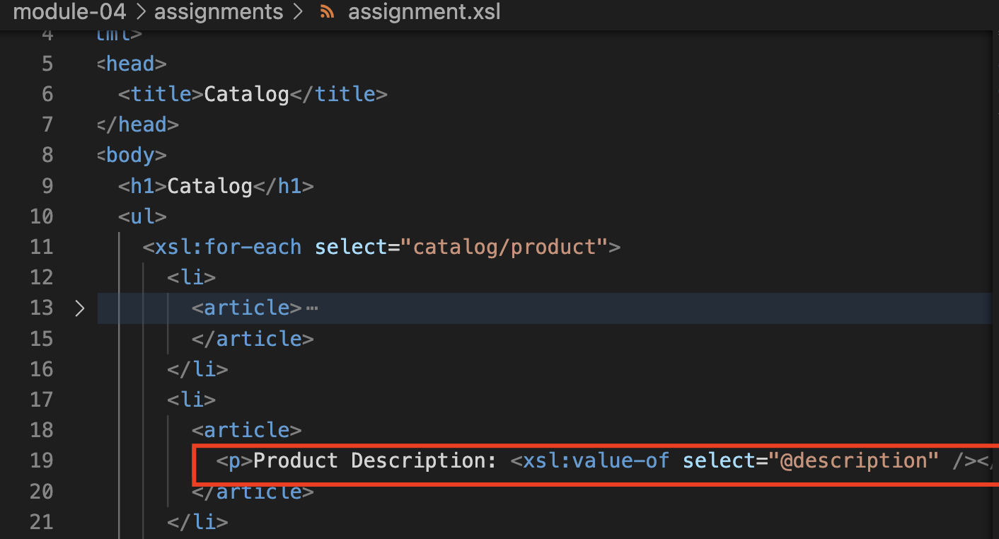
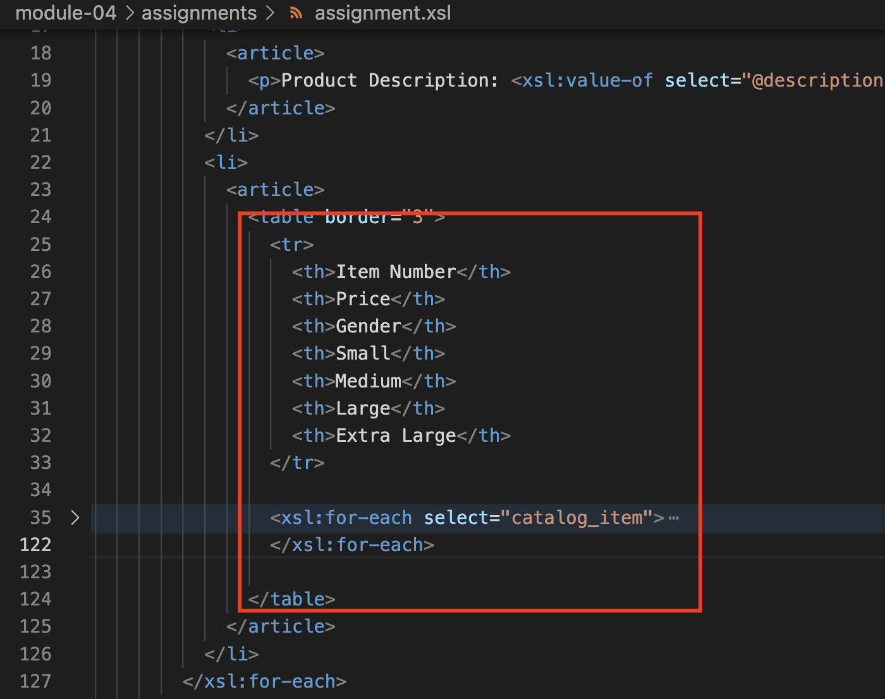
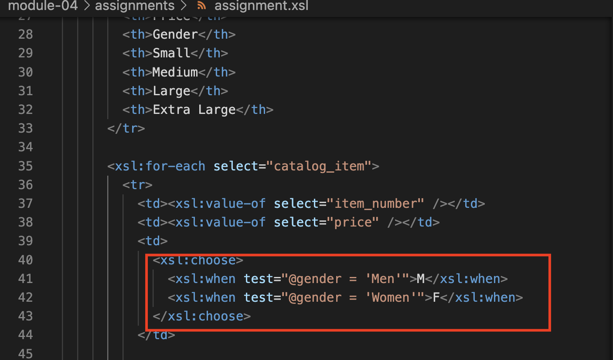
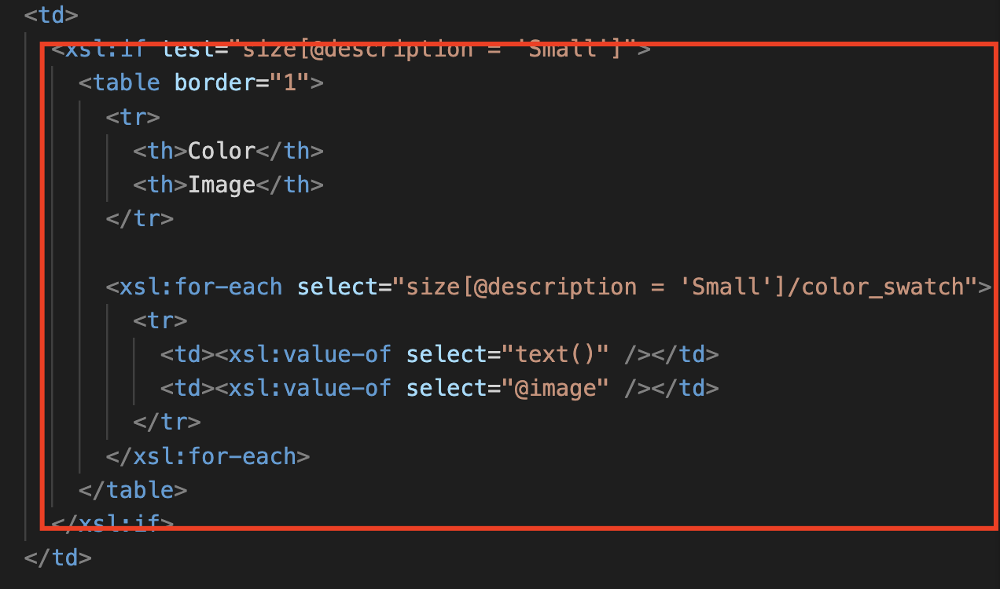
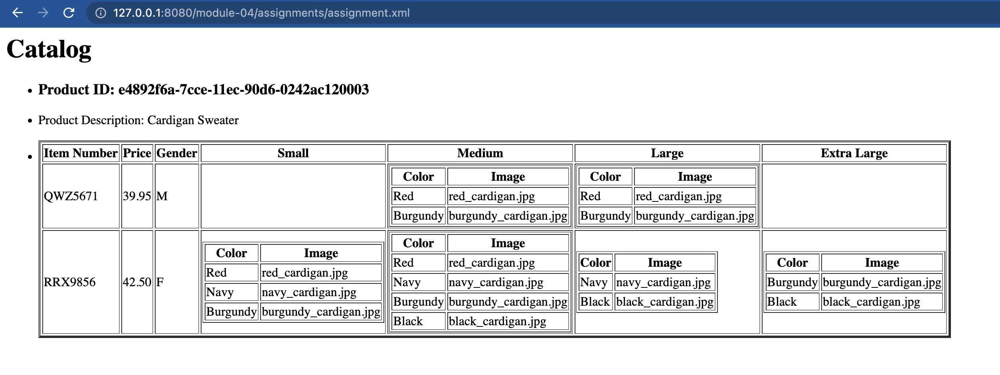

# Assignment

1. Open `module-4/assignments/assignment.xml` in your editor
2. Create xsl file and add link to it 
3. Display catalog in the following way

- main title is "Catalog" 
- use html list tag to display catalog 
- render each item as `<article>` inside list item tag 
- display product id as h3 
- display product description as paragraph 
- render table of catalog items with columns: item number, price, gender, small, medium, large, extra large (if column item is not present in item, then display empty cell) 
- for gender column render M for Men, W for Women 
- inside size columns (small, medium, large, and extra large) display subtable with 2 columns: color and image 

Thought Process:
In iterating inside the xml file, I used `xsl:for-each` to go through each product in the catalog and used list tag for each attribute. Since I am already in the product element, I have used another `xsl:for-each` to go through each catalog item. To implement a logic where certain text is to be displayed when it satisfies a condition, I used `xsl:choose` as it is similar to switch case functionality. Lastly, `xsl:if test` is used in testing a logic to determine if a subtable will be rendered in the cell. I added table borders to help separate the information in the table.

**Final Output**

